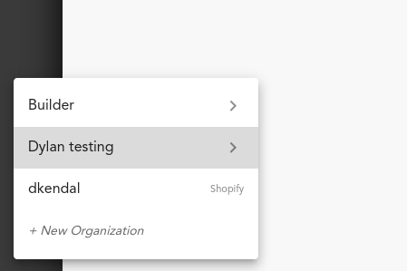
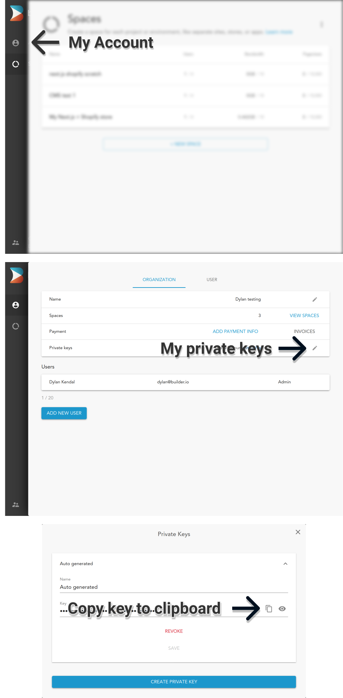

# Next.js + KiboCommerce + Builder.io starter kit

The ultimate starter for headless KiboCommerce stores.

Demo live at: [kibo-builder-starter](https://next-kibo-starter.vercel.app/)

## Goals and Features

- Ultra high performance
- SEO optimized
- Themable
- Personalizable (internationalization, a/b testing, etc)
- Builder.io Visual CMS integrated
- UI Components built on top of Material UI 5
- Theming
- KiboCommerce data hooks
- PWA Ready
- Omni Channel Capability (Ship to home and Pickup in Store support)

## Table of contents

- [Getting Started](#getting-started)
  - [1: Create an account for Builder.io](#1-create-an-account-for-builderio)
  - [2: Your Builder.io private key](#2-your-builderio-private-key)
  - [3: Clone this repository and initialize a Builder.io space](#3-clone-this-repository-and-initialize-a-builderio-space)
  - [4. KiboCommerce store](#4-kibocommerce-store)
  - [5. Connecting Builder to KiboCommerce](#5-connecting-builder-to-kibocommerce)
  - [6. Configure the project to talk to KiboCommerce](#6-configure-the-project-to-talk-to-kibocommerce)
  - [7. Up and Running!](#7-up-and-running)
- [Deploy](#deploy)

<!-- markdown-toc end -->

## Getting Started

**Pre-requisites**

This guide will assume that you have the following software installed:

- nodejs (>=12.0.0)
- npm
- git

You should already have a [KiboCommerce](https://kibocommerce.com/) account and store created before starting as well.

**Introduction**

This starter kit is everything you need to get your own self hosted
Next.js project powered by Builder.io for content and KiboCommerce as an
e-commerce back office.

After following this guide you will have

- A Next.js app, ready to deploy to a hosting provider of your choice
- Pulling live collection and product information from KiboCommerce
- Powered by the Builder.io visual CMS

### 1: Create an account for Builder.io

Before we start, head over to Builder.io and [create an account](https://builder.io/signup).

### 2: Your Builder.io private key

Head over to your [organization settings page](https://builder.io/account/organization?root=true) and create a
private key, copy the key for the next step.

- Visit the [organization settings page](https://builder.io/account/organization?root=true), or select
  an organization from the list



- Click "Account" from the left hand sidebar
- Click the edit icon for the "Private keys" row
- Copy the value of the auto-generated key, or create a new one with a name that's meaningful to you



### 3: Clone this repository and initialize a Builder.io space

Next, we'll create a copy of the starter project, and create a new
[space](https://www.builder.io/c/docs/spaces) for it's content to live
in.

In the example below, replace `<private-key>` with the key you copied
in the previous step, and change `<space-name>` to something that's
meaningful to you -- don't worry, you can change it later!

```
git clone https://github.com/BuilderIO/kibocommerce-nextjs-starter.git
cd kibocommerce-nextjs-starter

unzip builder

npm install --global "@builder.io/cli"

builder create --key "<private-key>" --name "<space-name>" --debug
```

If this was a success you should be greeted with a message that
includes a public API key for your newly minted Builder.io space.

_Note: This command will also publish some starter builder.io cms
content from the ./builder directory to your new space when it's
created._

```bash
  ____            _   _       _                     _                    _   _ 
 | __ )   _   _  (_) | |   __| |   ___   _ __      (_)   ___       ___  | | (_)
 |  _ \  | | | | | | | |  / _` |  / _ \ | '__|     | |  / _ \     / __| | | | |
 | |_) | | |_| | | | | | | (_| | |  __/ | |     _  | | | (_) |   | (__  | | | |
 |____/   \__,_| |_| |_|  \__,_|  \___| |_|    (_) |_|  \___/     \___| |_| |_|
                                                                               
|████████████████████████████████████████| getting space settings | 2/2
|████████████████████████████████████████|  product-page-footer: ./builder/product-page-footer/hammock-footer.json  | 
|████████████████████████████████████████|  page: ./builder/page/homepage.json  | 1/1


Your new space "next.js kibo starter" public API Key: 012345abcdef0123456789abcdef0123
```

Copy the public API key ("012345abcdef0123456789abcdef0123" in the example above) for the next step.

This starter project uses dotenv files to configure environment variables.
Open the files [.env.development](./.env.development) and
[.env.production](./.env.production) in your favorite text editor, and
set the value of `BUILDER_PUBLIC_KEY` to the public key you just copied.
You can ignore the other variables for now, we'll set them later.

```diff
+ BUILDER_IO_API_KEY=012345abcdef0123456789abcdef0123
- BUILDER_IO_API_KEY=
# ... your other credentials
```

### 4. KiboCommerce store

The following data is required to configure the storefront to communicate with your Kibo API Client.

- `apiHost` - Your Kibo Commerce API Host.
- `authHost` - Kibo Commerce Authentication Host Server. It is used to request an access token from Kibo Commerce OAuth 2.0 service. Production and Production sandbox, use `home.mozu.com`
- `clientId` - Unique Application (Client) ID of your Application
- `sharedSecret` - Secret API key used to authenticate application. Viewable from your [Kibo eCommerce Dev Center](https://mozu.com/login)
- `builderIOApiKey` - Unique API key used to authenticate your Builder IO

Visit [Kibo documentation](https://apidocs.kibong-perf.com/?spec=graphql#auth) for more details on API authentication
### 5. Connecting Builder to KiboCommerce

Access your newly created space by selecting it from the [list of spaces](https://builder.io/spaces?root=true)
in your organization.

You should be greeted by a modal asking for various your storefront Access toke (from preview step) and your store domain, this will allow Builder.io to communicate with your store API:


Fill in the required keys and press "Connect your KiboCommerce Store"!

### 6. Configure the project to talk to KiboCommerce

Open up [.env.template](./.env.template), you will see which keys you will have to configure to have access to your store. When you have all of the required keys, your `.env` file should look like this:

```bash
KIBO_API_HOST=t1234-s1234.sandbox.mozu.com
KIBO_AUTH_HOST=home.mozu.com
KIBO_CLIENT_ID=KIBO_APP.1.0.0.Release
KIBO_SHARED_SECRET=12345_Secret

BUILDER_IO_API_KEY=12345_Your_API_Key
```

### 7. Up and Running!

The hard part is over, all you have to do is start up the project now.

```bash
npm install
npm run dev
```

This will start a server at `http://localhost:3000`.

### 8. Start building

Now that we have everything setup, start building and publishing pages on builder.io.

## Deployment Options

You can deploy this code anywhere you like - you can find many deployment options for Next.js [here](https://nextjs.org/docs/deployment). The following options support one click installs and are super easy to start with:

[](https://vercel.com/new/git/external?repository-url=https%3A%2F%2Fgithub.com%2FBuilderIO%2Fkibocommerce-nextjs-starter)

- Vercel: for more information check [Vercel docs on Next.js deployments](https://vercel.com/docs/next.js/overview) Or try the one click install by clicking the button above.

[](https://app.netlify.com/start/deploy?repository=https://github.com/BuilderIO/kibocommerce-nextjs-starter)

- Netlify: For more information check [Netlify docs on Next.js deployments](https://www.netlify.com/blog/2020/11/30/how-to-deploy-next.js-sites-to-netlify/) Or try the one click install by clicking the button above.
